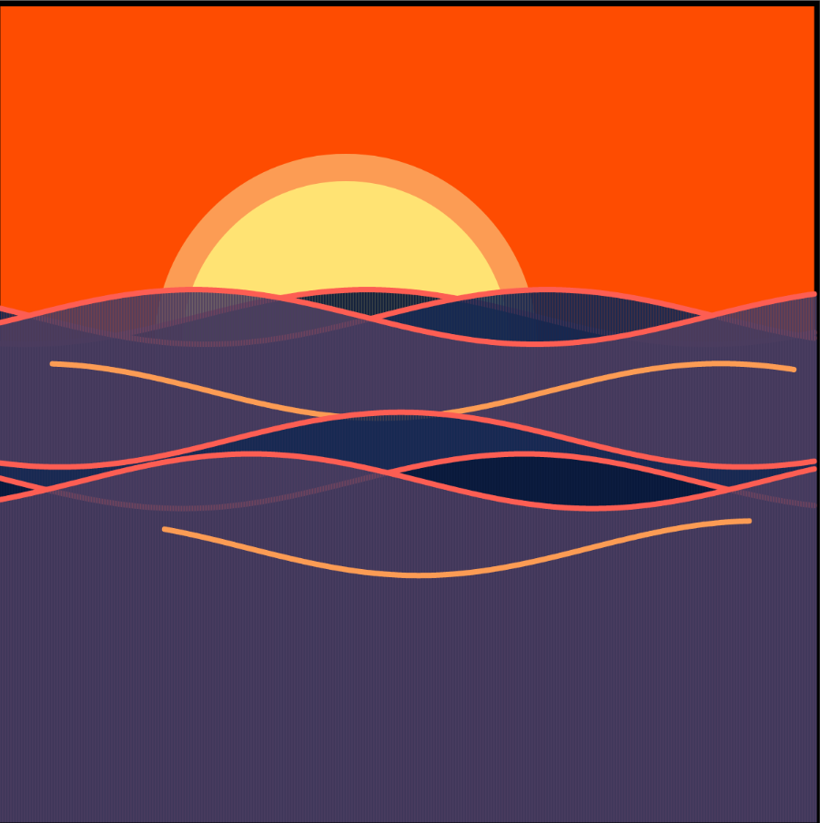
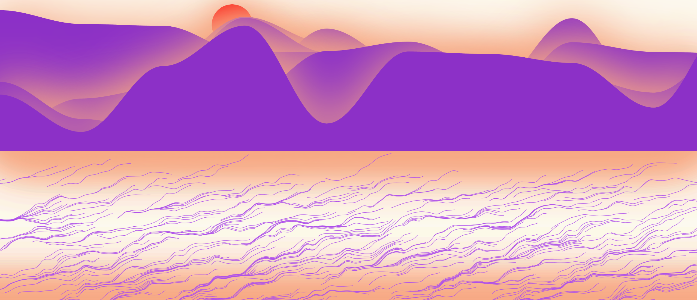
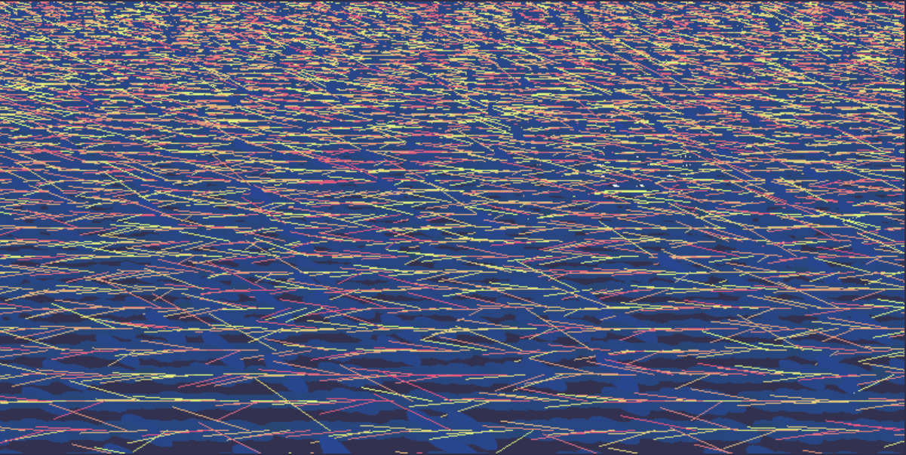
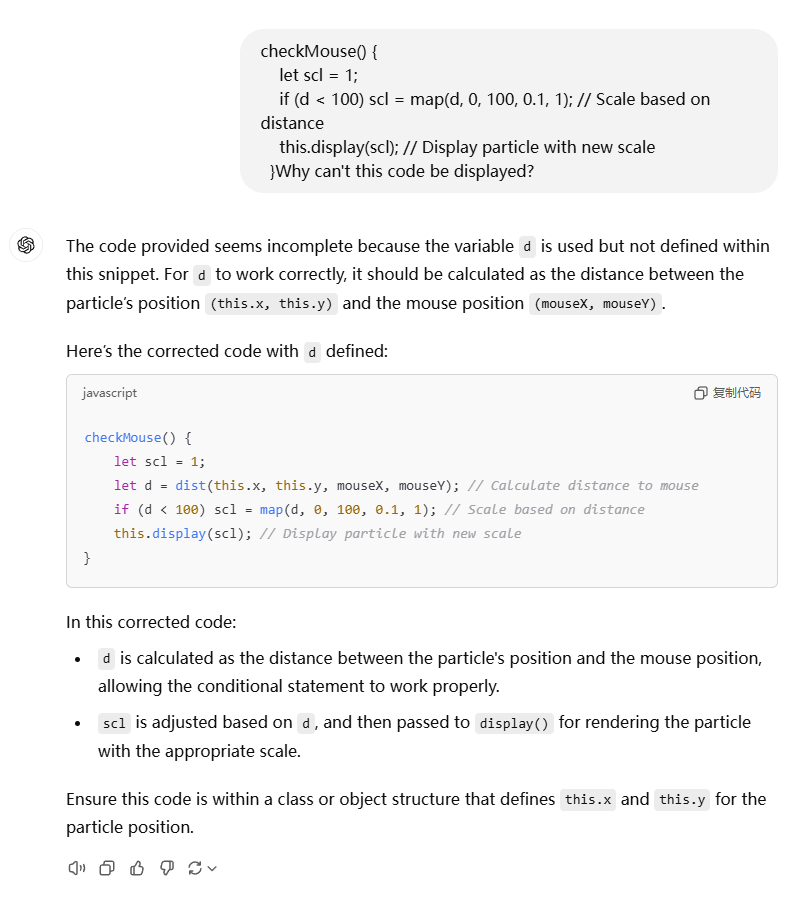

# tili0698_9103_tut5

# Major Assignment Design 

## Part 1: Instructions on how to interact with the work

By moving the mouse in the sky area above, a circle within a radius of 100 will grow from small to large with the mouse as the center.
The color of the water surface formed by the oval below will be affected by the left and right mouse (mouseX)
Decrease/increase the speed of the wave by pressing "a" and "d"
Decrease/increase the height of the wave by pressing "s" and "w"
Press "space" to increase the height of each ellipse. You can increase it up to ten times, after which you can restore it by pressing again.

## Part 2: Details of individual approach to animating the group code

### User Input

### Which properties of the image will be animated and how

In the overall picture, the house part remains unchanged. The water surface curve composed of ellipses will move in a wave shape to highlight the dynamic effect of the water surface, and will be presented in HSB color, with subtle color changes achieved through noise code to express the light and shadow effect of light on the water surface at dusk. The width of the ellipse will also change to increase the layering of the curve. Finally, in the sky part, I intend to enhance the three-dimensional sense of the picture by enlarging and reducing the circle near the mouse.

### how it is unique from other group members

Because I am writing User Input code, I first created an area below the code to indicate the operation. Secondly, compared to other team members' codes, in my code, users can interact with the keyboard and mouse to change the screen and achieve different effects. The colors in the screen are not random or change over time, and users need to move the mouse to change them.

---

## Part 3: inspiration

### Example 1

[View Full Code Example](https://openprocessing.org/sketch/1028497)

This display of ripples on the water was my initial inspiration for the water surface in the painting.

### Example 2

week7 The painting of Mona Lisa is also a source of inspiration for me. In class, the teacher taught us how to make the circle closer to the mouse smaller. I hope to apply this technology to my design.

### Example 3

Reference: Steam-Wallpaper Engine-梵高星空The Starry Night

Van Gogh's Starry Night is also one of my creative inspirations. By chance, I found other people's artistic creations of this painting in Steam's wallpaper engine. The particle effect composed of circles in the painting rotates around the center of the circle, which is very eye-catching. This is why I want to change the size of the circle within the mouse range.

### Example 4

[View Full Code Example](https://openprocessing.org/sketch/2170845)

At first I wanted to use this kind of line changes to achieve the feeling of ripple movement on the water surface, but this was somewhat similar to the Perlin noise I made, so I did not adopt this method.

### Example 5

[View Full Code Example](https://openprocessing.org/sketch/230363)

Although this code expresses the reflection of light on the water surface by changing the position of lines of different colors, I can also express the reflection of the water surface by changing the color without changing the position of the shape. After comparing with the previous example, I decided to use Perlin noise to change the color of each part of the water surface according to the left and right of the mouse (mouseX).

---

## Part 4: short technical explanation

No large changes were made to the group code

## P5.js help

lerpcolor() https://p5js.org/reference/p5/lerpColor/ 

Code Explanation

for (let y = 0; y < height * 0.5; y += 1)  This for loop starts at y = 0 and ends at half of the canvas, increasing by 1 each time. It will iterate over all rows of pixels in the upper half of the canvas. 

let c = lerpColor(c1, c2, map(y, 0, height * 0.5, 0, 1)) The lerpColor function interpolates between colors c1 and c2 to create a smooth color transition.

stroke(c) Set the current color to c to facilitate the next step.

line(0, y, width, y); // Draw horizontal line for gradient

The same is true for the lower part

ellipse() https://p5js.org/reference/p5/ellipse/

Code Explanation

ellipse(The x coordinate of the center, The Y coordinate of the center, Width, Height);

## Question ask Gpt

I had a problem writing code that changes the size of a circle based on the mouse position. I asked GPT.

