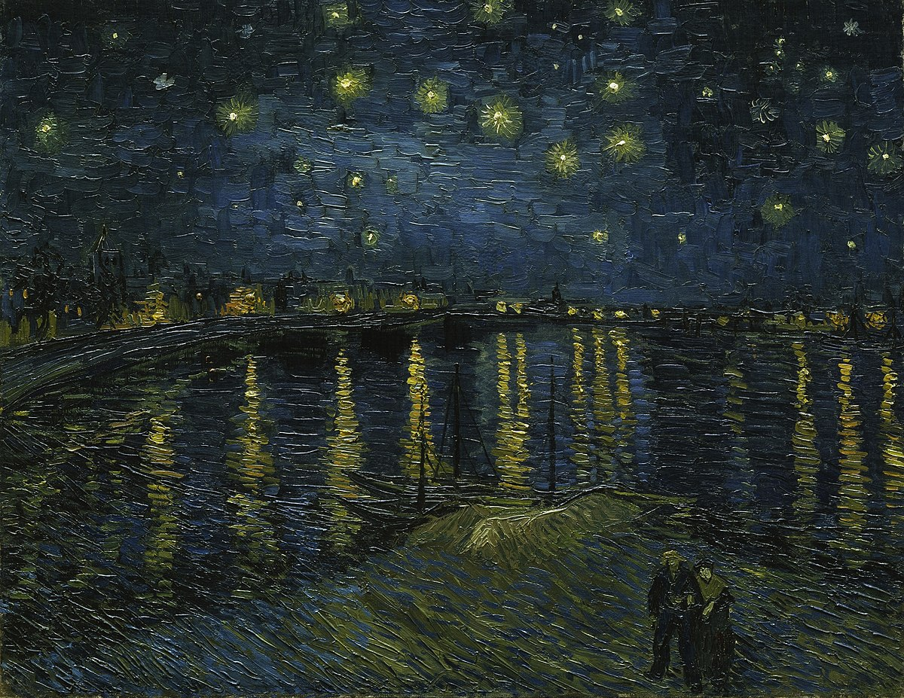
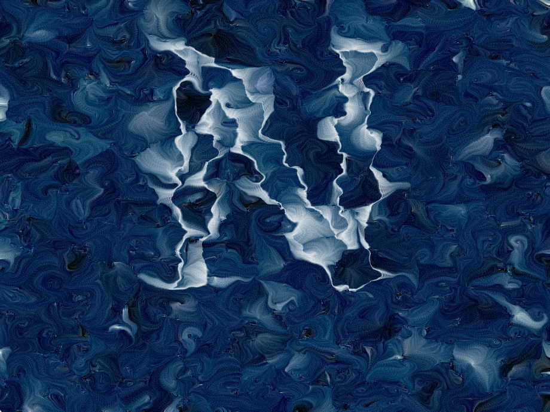

# tili0698_9103_tut5

# Major Assignment Design Research

## Part 1: Imaging Technique Inspiration

Since our group has ultimately decided to use Monet's **"Saint Georges majeur au crépuscule"** for the major assignment, I am exploring other paintings that display similar water surface ripples for inspiration.

### 1. Monet's *"Water Lilies"*

In **Monet's "Water Lilies"**, the artist uses color blocks to represent light reflections on the water surface. This technique can be replicated using code, especially Java, to simulate dynamic ripples and light interactions. The abstract representation of water surface ripples offers a visually compelling method for capturing natural fluidity in our project.

### 2. Van Gogh's *"Starry Night Over the Rhône"*

In **Van Gogh's "Starry Night Over the Rhône"**, the artist uses lines to depict the reflection of light on the water surface. The use of flowing, curvilinear lines brings an expressive dynamism to the water's appearance, providing inspiration for how we might approach line-based water effects in code.

### Combining Techniques

In **Monet's "Saint Georges majeur au crépuscule,"** there is a significant interplay between light and the water surface, which involves both color and line. By combining the color-blocking method seen in *"Water Lilies"* and the line-based reflection seen in *"Starry Night Over the Rhône,"* I believe we can create an impactful visual design for our major assessment.

---

## Part 2: Coding Technique Exploration

### 1. Randomly Generated Color Blocks

[View Full Code Example](https://openprocessing.org/sketch/2290930)

This technique uses randomly generated lines of different colors to form color blocks, similar to the way oil painting captures light reflection through abstract shapes. It provides a dynamic, impressionistic effect that can simulate the fluidity of water surface ripples in our project.

### 2. Customizable Water Ripples

[View Ripple Code Example](https://openprocessing.org/sketch/2157583)

Similarly, this technique uses lines to simulate water surface ripples. The code allows for customization of ripple shapes while still preserving randomness, giving us greater design flexibility. This approach can help us achieve a more impressionistic water effect in our project.

---

## Conclusion

By incorporating both randomly generated color blocks and customizable ripple lines, we can recreate the interplay of light and water seen in Monet’s and Van Gogh's works. These coding techniques will enable us to balance abstraction and dynamism, making our major project both visually striking and technically impressive.

    

